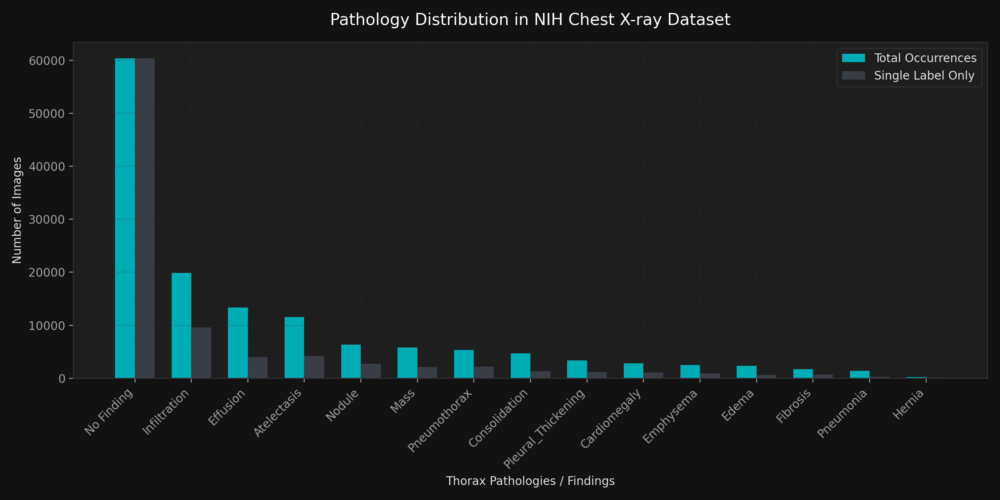
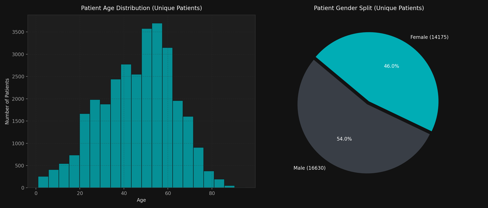

# NIH Chest X-ray Dataset Analysis Report

This folder contains the visual analysis and characteristics of the NIH ChestX-ray14 dataset.

---

## 1. Core Summary Metrics
* **Total X-ray Images**: 112,120
* **Unique Patients**: 30,805
* **Average Scans per Patient**: 3.64
* **No Finding Ratio**: 53.84% (60,361 images)
* **Single Pathology Ratio**: 27.62% (30,963 images)
* **Multi-label Pathology Ratio**: 18.55% (20,796 images)

---

## 2. Visualizations

### A. Class Distribution
This chart shows the absolute occurrences of each pathology in the dataset, split by whether they occur alone (Single Label) or with other co-occurring diseases.

### B. Disease Co-occurrence Matrix
A heatmap displaying the co-occurrence frequencies of the 14 pathologies. It highlights which conditions commonly exist together (such as **Infiltration** and **Atelectasis**).

### C. Patient Demographics
Histograms representing unique patient age distribution (filtered for normal biological range <= 100 years) and the gender split.

---

*This report was generated automatically on 2026-07-18.*
